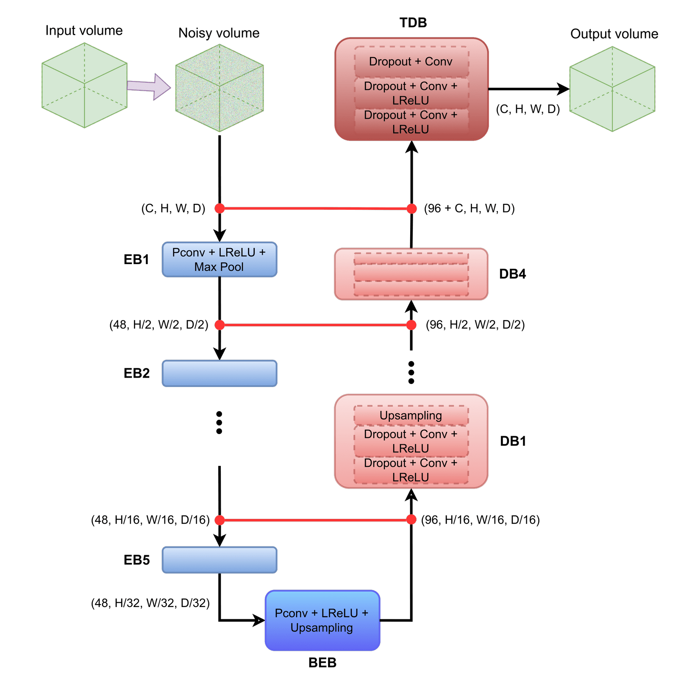
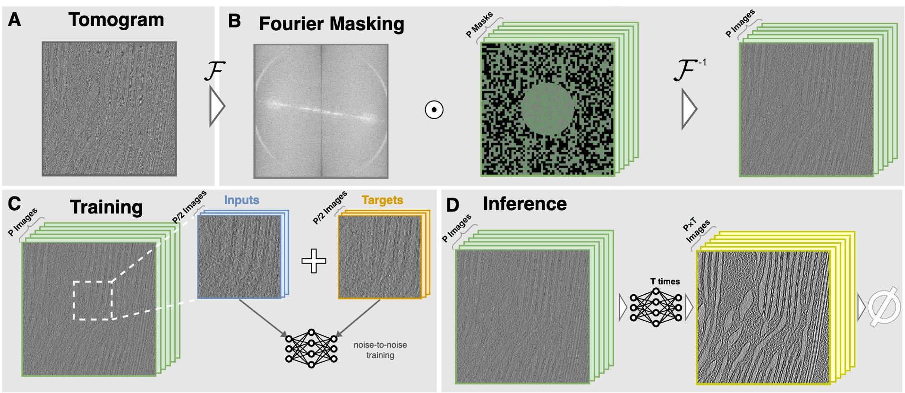

# F2Fd <!-- omit in toc --> 
Fourier Perturbations for Denoising Cryo-Electron Tomograms and Comparison to Established Approaches

- [1. Abstract](#1-abstract)
  - [1.1. Architecture](#11-architecture)
- [2. Installation](#2-installation)
- [3. Example of usage](#3-example-of-usage)
  - [Description of most important script arguments](#description-of-most-important-script-arguments)
- [4. Fourier space sampling](#4-fourier-space-sampling)
- [5. Membrane segmentation downstream task](#5-membrane-segmentation-downstream-task)
- [6. Results summary](#6-results-summary)

## 1. Abstract

Cryo-electron tomography (Cryo-ET) is an imaging technique capable of visualizing compartments of single cells at sub-nanometer resolution in 3D. However, beam induced damage limits the applied electron dose and leads to a low signal-to-noise ratio. A popular method for denoising cryo-electron tomograms is Cryo-CARE, which performs Noise2Noise training that relies on splitting the 2D tilt series in two separate halves. In practice, often the original tilt series is not available, but only the reconstructed volume, to which Cryo-CARE cannot be applied. Other more general denoising methods such as Noise2Void or Self2Self with dropout do not require noisy image pairs and work with single noisy inputs. However, these methods implicitly assume noise to be pixel-independent, which is not the case for Cryo-ET. Here, we propose F2Fd, a deep learning denoising algorithm that can be applied directly to reconstructed cryo-electron tomograms. F2Fd creates paired noisy patches of tomograms by perturbing high frequencies in Fourier space and performs noise-to-noise training with them. We benchmark F2Fd with five other state-of-the-art denoising methods, including Noise2Void, Self2Self, Wiener-like filtering, Isonet and Cryo-CARE on both synthetic and real tomograms. We show in our experiments that the perturbation in Fourier space is better suited for Cryo-ET noise than noise from real space used by Noise2Void and Self2Self. Moreover, we illustrate that Cryo-ET denoising not only leads to cleaner images, but also facilitates membrane segmentation as an important downstream task. 

### 1.1. Architecture

The implemented denoising network is based on the U-net as follows:

3D implementation of the network based on the U-net used to map noisy volumes to denoised outputs. Blue boxes (EB#) are part of the encoding path; red ones are used for the decoding path (DB#).

## 2. Installation 

[Install Miniconda](https://docs.conda.io/en/latest/miniconda.html), then add the _pytorch, simpleitk, anaconda_ and _conda-forge_ channels:

`conda config --add channels pytorch --add channels simpleitk --add channels anaconda --add channels conda-forge`

Afterwards, create the `F2Fd` environment and install requirements:

- `conda create -n F2Fd python=3.9 pytorch torchvision torchaudio pytorch-cuda=11.6 -c pytorch -c nvidia`
- `conda activate F2Fd`
- `conda install --file requirements_F2FdDenoising.txt`

Finally, install F2Fd package:

- `pip install --editable ./F2Fd/.`

## 3. Example of usage

Denoise sample data from the [SHREC 2021 Challenge](https://www.shrec.net/cryo-et/) using our sample script in three steps:

1. Define logging directories and input tomograms: just specify where the directories for your experiment arguments, your model logs and data directories will be stored.
2. Define training arguments for the dataloader and the network (see description below)
3. Train the network

### Description of most important script arguments
ToDo

## 4. Fourier space sampling

Workflow to obtain an input batch using Bernoulli samples in Fourier space. First, the Fourier transform of the input image, $\mathcal{F}(\hat{x})$, is calculated. Then, Bernoulli masks and the inverse Fourier transform are used to obtain a fixed pool of images that will be sampled without replacement for each patch. The first half of the samples are used to obtain the input patch and the last half to obtain the target patch, shown in green and orange, respectively. This process is repeated for $N$ patches.

**Inference**

The final denoised image is obtained by predicting the individual patches of the input image and averaging in a similar fashion as described for the real space strategy. More specifically, to predict one patch $p$, we start by selecting that patch and then obtaining $K$ versions of it from a random subset of size $K$ from the image pool, each version of the patch is denoted by $p_k$. We use the network with dropout turned on to generate $K$ different versions of predictions for the patch, denoted as $f_{\theta^*_t}(p_k)$, where $\theta^*_nt$ denotes a subset of the parameters of the trained network at iteration $n$. We then repeat this process $T$ times to obtain the denoised patch $z$ by averaging the predictions. Or, more succinctly:

$$z = \frac{1}{K \cdot T} \sum_k \sum_t f_{\theta^*_t}(p_k)$$

and we repeat this process for each patch of the image. Taking the average of the denoised patches whenever there is overlap between them.

## 5. Membrane segmentation downstream task

## 6. Results summary
